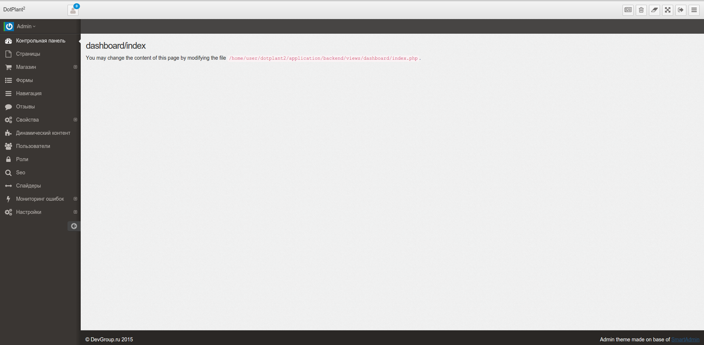
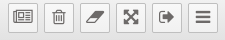
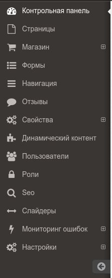

# Обзор администравного раздела

Главная страница административного раздела DotPlant2 состит из 3х блоков:
* Верхнее меню
* Контентная часть
* Левое меню

1. Верхнее меню

    

    Кнопки (слева на право):
    * Перейти на сайт
    * Очистка корзины
    * Очистка кеша
    * Полный экран
    * Выход из административной части
    * Свернуть меню

2. Контентная часть будет меняться в зависимости от выбранного пункта левого меню.

3. Левое меню

    
    
    Пункты меню:
    ### Контрольная панель 
    
    Этот пункт переводит на главную страницу административного раздела DotPlant2
    
    ### Страницы 
    
    Раздел редактирования контентных страниц. 
    
    В этом разделе можно добавлять, удалять и редактировать страницы сайта.
    
    При открытии этого пункта можно увидеть дерево страниц в левой части контентного блока и список дочерних страниц в правой части
    
 ### Магазин 
    
    Раздел для управления интернет-магазином. Раздел состоит из следующий пунктов:
    
    * #### Категории 
    
    Раздел редактирования, создания и удаления категорий товаров магазина. Внешне похож на раздел Страницы.
    
    * #### Продукты 
    
    Раздел для управления списком товаров на сайте. Внешне похож на раздел Категории, за исключением того, что в правой части находится блок с товарами из выбранной категории.
    
    * #### Заказы
    
    Раздел управления заказами интернет магазина. В этом разделе можно просмотреть заказы и отредактировать их. Открыв раздел, можно увидеть список заказов, отсортированных по дате (от новых к старым). Если нажать на иконку в виде глаза, можно просмотреть подробную информацию по заказу и отредактировать его.
    
    * #### Статусы заказа 
    
    Раздел управления статусами заказов. Тут можно добавить новые статусы или отредактировать существующие.
    
    * #### Типы оплаты 
    
    Раздел управления платежными системами. В этом разделе можно активировать/деактивировать существующие способы оплаты, а так же добавить или удалить новые платежные системы.
    
    * #### Способы доставки 
    
    В этом разделе изменять, добавлять, удалять способы доставки, а так же, устанавливать влияние выбранного способа доставки на сумму заказа.
    
    * #### Группы категорий 
    
    В этом разделе осуществляется управление группами категорий интернет магазина (например группы “Товары” и “Услуги”).
    
    * #### Предфильтрованные страницы 
    
    Раздел для управления контентом на страницах фильтров. Позволяет задать SEO-свойства отфильтрованной страницы каталога (ЧПУ, h1, title), контента и аннонса страницы.
    
 ### Формы

 Раздел для управления формами на сайте и просмотра заполненых форм. Подробнее http://docs.dotplant.ru/ru/Forms 

 ### Навинация 
    
 Раздел для управления меню на сайте. Подробнее http://docs.dotplant.ru/ru/Navigation 
    
 ### Отзывы 
    
 Раздел для просмотра отзывов оставленных на сайте. Подробнее http://docs.dotplant.ru/ru/Reviews 
    
 ### Свойства
    
 Раздел состоит из 2х пунктов:
    
 * Свойства - раздел для управления всевозможными свойствами для страниц, продуктов, категорий и тд.
 * Представления - раздел для управления кастомными шаблонами представления на сайте.
    
 ### Динамический контент
    
 SEO-раздел для добавления блоков на заданные страницы.
    
 ### Пользователи 
    
 Раздел управления пользователями. В нем можно создать новых пользователей, удалить существующих, назначить права доступа и поменять пароль.
    
 ### Роли 
    
 Раздел управления ролями. Во вкладке "Разрешения" можно управлять всеми возможными сценариями доступа, во вкладке "Роли" можно разрешать/запрещать ролям выполнять те или иные действия.
    
 ### Seo
    
 СЕО-раздел для управления мета-тегами, счетчиками (Яндекс.Метрика, Google Analytics и тд), файлом robots.txt и серверными перенаправлениями.
    
 ### Слайдеры 
    
 Раздел для управления слайдерами. Позволяет создавать/удалять слайдеры, добавлять изображения к существующим слайдерам и менять настройки отображения.
    
 ### Мониторинг ошибок 
    
 Раздел для настройки монитора ошибок. Состоит из 2х пунктов:
    
 * Monitor - в этом разделе можно просматривать все ошибки в работе сайта.
 * Конфигурации - раздел для настройки монитора ошибок и получения уведомления об ошибках по электронной почте.
   
 ### Настройки 
 
 Конфигурационный раздел. Состоит из следующих пунктов:
 
    * Задачи - раздел для управления фоновыми задачами DotPlant2. Дает возможность настроить выполнение определенной задачи с определенной прериодичностью. Подробнее http://docs.dotplant.ru/en/Backend/Background_Tasks.html
    * Конфигурации - раздел для управления настройками DotPlant2.
    * I18n - раздел для управления переводом сайта на разные языки.
    * Проверка на спам - в этом разделе осуществляется настройка проверки на спам заполненных форм через сервисы Yandex API или Akismet API.
    * Меню админки - Раздел для управления левым меню административной части DotPlant2.
    * Данные - раздел для импорта/экспорта данных. Подробнее http://docs.dotplant.ru/ru/Import_Export 
    * YML - раздел, позволяющий сделать выгрузку каталога в Яндекс.Маркет.
    * API

